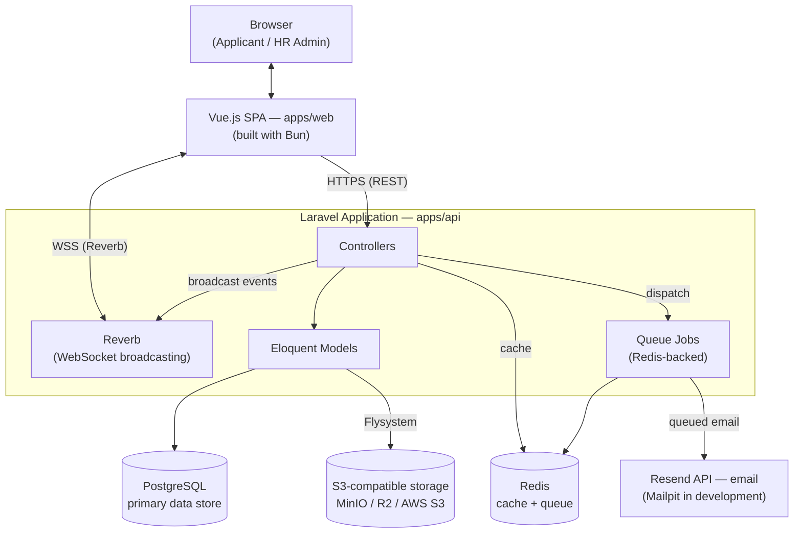

# ARCHITECTURE.md — Technical Architecture

**Project:** e-recruitment
**Version:** 1.0

## 1. Architectural Style

This system follows a **monolithic MVC architecture** (Laravel backend + Vue.js frontend as a decoupled SPA), not microservices. This is a deliberate choice given the project's scale: single-tenant, one deployment per company, no need for independent service scaling. Microservices would add operational complexity (service discovery, inter-service auth, distributed tracing) with no corresponding benefit at this scale — see [`docs/DECISIONS.md`](DECISIONS.md) for the explicit ADR.

## 2. High-Level Structure

The only external integration called from Laravel is the **Resend API** for email (Mailpit in development). Interview scheduling does **not** call any external Calendar/Meet API — HR provides the meeting link manually (see Section 7 and `docs/DECISIONS.md` ADR-024).

## 3. Why Each Technology Was Chosen

| Choice | Rationale |
|---|---|
| **Laravel** | Mature, well-documented PHP framework with built-in support for everything this project needs natively: Eloquent ORM, queues, broadcasting (Reverb), Flysystem (S3-compatible storage abstraction) — minimizes custom glue code |
| **Vue.js (not Nuxt)** | Project doesn't need server-side rendering or Nuxt's file-based routing conventions; a plain Vue 3 SPA talking to a Laravel API is simpler to reason about and deploy independently from the backend |
| **Bun (frontend package manager)** | Faster install/build times than npm/yarn/pnpm; deliberate project-wide standard — see `AGENTS.md` Section 8 for the enforcement rule. This is a project convention choice, not a Vue/Laravel requirement |
| **PostgreSQL** | Strong support for JSONB (used in `applications.additional_data`), mature ecosystem, works identically across Railway and self-hosted Docker Compose — no portability concerns |
| **Laravel Reverb** | First-party Laravel WebSocket server — avoids adding a third-party real-time service (Pusher, Ably) as an external dependency, which matters for the self-hosted/portable delivery model (Section 5) |
| **S3-compatible storage via Flysystem** | Laravel's Flysystem abstraction means the storage backend (MinIO, Cloudflare R2, AWS S3) is swappable via environment variables alone — no code change required when a client migrates storage providers |
| **Resend (production) / Mailpit (development)** | Resend has a clean API and good deliverability; Mailpit avoids sending real emails during local development. Both integrate via Laravel's standard Mail facade, so swapping providers later is a config change, not a code change |
| **Manual meeting links for interviews (no external Calendar/Meet API, no embedded WebRTC)** | HR pastes a meeting link from any platform (Google Meet, Zoom, Teams, etc.) when scheduling an interview; the system only validates the URL format, stores it, and emails it. Building or licensing real-time video infrastructure was judged disproportionate effort for a supporting feature, and the originally planned external Calendar API was dropped to avoid a hidden Google Workspace deployment dependency — see `docs/DECISIONS.md` ADR-024 (which superseded ADR-003/ADR-023). |

## 4. Single-Tenant Architecture (No Multi-Tenancy)

This is the most significant architectural constraint distinguishing this project from a typical SaaS product:

- **No `tenant_id` column anywhere in the schema** (see [`docs/SCHEMA.md`](SCHEMA.md)). Every table implicitly belongs to "the one company" this deployment serves.
- **No tenant-scoping middleware or query scopes.** Application code never needs to ask "which company does this belong to" — there is only one.
- **Each company gets its own complete deployment** — its own database, its own Redis instance, its own object storage bucket. There is no shared infrastructure between two different companies' deployments.

This significantly simplifies the codebase compared to a multi-tenant system (like `zhire`, a separate unrelated project) — there is no risk of cross-tenant data leakage because there is no cross-tenant concept to leak across.

## 5. Dual Deployment Strategy

This project has **two distinct deployment targets** for two different phases of its lifecycle.

### 5.1 Development Phase — Railway

During active development (current phase, including the academic coursework context this project originated from), the application deploys to **Railway**. Railway provides managed PostgreSQL, Redis, and easy environment variable management — optimized for fast iteration, not for the eventual delivery model.

### 5.2 Production/Delivery Phase — Docker Compose (Self-Contained)

Because this software is **licensed once per company** rather than hosted as an ongoing SaaS (see [`docs/PRD.md`](PRD.md) Section 5), the production delivery artifact is a **portable Docker Compose stack** that a company can run on:
- A VPS the developer manages on the client's behalf
- A VPS the client manages themselves
- An on-premise server within the client's own infrastructure

The Docker Compose stack (`docker/docker-compose.prod.yml`) bundles:
- The Laravel API container
- The Vue.js build (served as static assets, e.g. via Nginx)
- PostgreSQL
- Redis
- MinIO (default object storage — swappable to Cloudflare R2/AWS S3 via env vars without changing the Compose file's structure)

**Critical constraint:** the application code must never assume Railway-specific behavior (e.g. Railway's automatic env var injection patterns) in a way that would break under plain Docker Compose. All configuration flows through standard `.env` files, documented exhaustively in [`docs/ENVIRONMENT.md`](ENVIRONMENT.md).

## 6. Branding Configurability

Per [`docs/PRD.md`](PRD.md) and [`docs/DECISIONS.md`](DECISIONS.md), the product name and logo must be configurable per-deployment without code changes:

- `APP_NAME` environment variable controls the name displayed in the page title, header, and outgoing email templates. No string in the codebase should hardcode "e-recruitment" as a user-facing label — `e-recruitment` is the repository/codebase name only.
- `APP_LOGO_URL` environment variable controls the logo asset shown in the UI.
- Changing either requires an application restart (no live-reload admin settings panel — see `docs/DECISIONS.md` for why this was kept simple rather than building a settings UI).

## 7. Background Jobs & Queue Strategy

Redis-backed queues (via Laravel's queue system) handle:
- **Email notifications** (FR-014) — always queued, never sent synchronously in the request lifecycle, so a slow/failing email provider never blocks a user-facing action (see `docs/SEQUENCE-DIAGRAM.md` Alur 1).
- **Job posting auto-close** — a scheduled job (Laravel's task scheduler) checks `job_postings.deadline` and transitions expired postings to `status = 'closed'` automatically (supports FR-006).

Interview scheduling (FR-015) involves **no external API call** — HR supplies the meeting link manually, so scheduling is a synchronous database write that returns immediately; only the applicant notification email is queued, like every other notification. See `docs/SEQUENCE-DIAGRAM.md` Alur 2 and `docs/DECISIONS.md` ADR-024, which superseded the earlier external-Calendar-API approach.

## 8. Real-Time Architecture (Chat)

Laravel Reverb provides WebSocket broadcasting for the per-application chat feature (FR-017):
- Each `ChatThread` maps to a **private broadcast channel** (`private-chat.{application_id}`), authorized per-request (only the specific applicant who owns the application and HR admins can subscribe — see [`docs/SECURITY.md`](SECURITY.md) for the authorization model).
- Channel subscriptions are authorized over `POST /api/broadcasting/auth`, registered under the `api` prefix with `auth:sanctum` middleware (token-based, no session/CSRF) to match the SPA's bearer-token auth. The same ownership rule (`Application::canAccessChat()`) guards both this channel and the REST chat endpoints — two independent enforcement points, one predicate. See `docs/DECISIONS.md` ADR-025.
- Messages are persisted to PostgreSQL (`chat_messages` table) before broadcasting the `MessageSent` event, ensuring no message is lost if a client is briefly disconnected — clients can always reload chat history from the database.

## 9. File Upload Handling (CV)

- CVs are validated server-side for both file extension **and actual MIME type** (not trusting the client-reported type) before being accepted.
- Valid files are streamed to S3-compatible storage via Laravel's Flysystem abstraction — never stored on local application disk in production (local disk doesn't survive container restarts/redeployments and doesn't scale across multiple app instances if that ever becomes necessary).
- See [`docs/SECURITY.md`](SECURITY.md) for the full threat model around file upload (the most common attack surface for a public-facing form).

## 10. Frontend Architecture Notes

- Vue.js SPA, built and managed exclusively with **Bun** (see `AGENTS.md` Section 8 — this is a hard project rule, not a suggestion).
- Animation: **GSAP** for complex/orchestrated animation (landing/marketing surfaces, scroll-triggered reveals), Vue's built-in `Transition`/`TransitionGroup` for standard UI state transitions — see [`docs/DESIGN-SYSTEM.md`](DESIGN-SYSTEM.md) Section 6 for the full principle of where each is used.
- Icons: Lucide (`lucide-vue-next`) exclusively — see [`docs/DESIGN-SYSTEM.md`](DESIGN-SYSTEM.md) Section 5.
- Base UI components (modals, dropdowns, accordions): **Reka UI** (`reka-ui`) — a framework-agnostic headless component library, chosen because it is not Nuxt-coupled.
- Real-time (chat): **`@laravel/echo-vue`** (the current official Vue client for Laravel broadcasting, providing `configureEcho` + the `useEcho` composable) over `laravel-echo` + `pusher-js` (Reverb speaks the Pusher protocol). Channel auth is delegated to the app's axios instance so the bearer token is applied automatically — see `docs/DECISIONS.md` ADR-025.

## 11. What This Architecture Explicitly Does Not Include

To prevent scope drift during implementation, the following are explicitly **not** part of this architecture and should not be introduced without a new ADR in `docs/DECISIONS.md`:

- No multi-tenancy / tenant scoping of any kind
- No embedded video calling infrastructure (WebRTC, Daily.co, Twilio Video) — interviews use external meeting links provided manually by HR
- No subscription billing or usage metering
- No microservices split — this stays a single Laravel monolith + single Vue SPA
- No npm/yarn/pnpm anywhere in `apps/web` — Bun only
