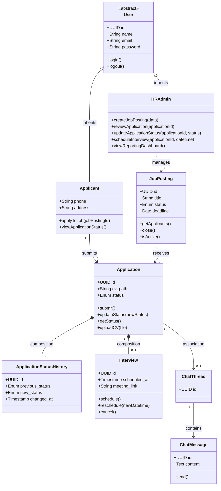

# CLASS-DIAGRAM.md — Domain Model

**Project:** e-recruitment
**Version:** 1.0

## 1. Tujuan

Dokumen ini merepresentasikan blueprint struktur statis sistem: entity apa yang ada, atribut yang disimpan, operasi (method) yang dapat dieksekusi, dan relasi antar entity. Ini merangkum penerapan arsitektur MVC pada level Model — lihat [`docs/ARCHITECTURE.md`](ARCHITECTURE.md) untuk bagaimana ini termanifestasi sebagai Eloquent Model di Laravel.

Implementasi konkret (migration, kolom database) ada di [`docs/SCHEMA.md`](SCHEMA.md) — dokumen ini adalah model domain konseptual, SCHEMA.md adalah turunannya yang lebih teknis (tipe data, index, foreign key).

## 2. Entity Utama

| Entity | Peran |
|---|---|
| `User` (abstract) | Parent class untuk semua jenis pengguna terautentikasi |
| `Applicant` | Pelamar — extends `User` |
| `HRAdmin` | Staf HR — extends `User` |
| `JobPosting` | Lowongan pekerjaan |
| `Application` | Lamaran — penghubung antara `Applicant` dan `JobPosting` |
| `Interview` | Jadwal interview — terhubung ke `Application` |
| `ChatThread` / `ChatMessage` | Komunikasi real-time per-lamaran |
| `ApplicationStatusHistory` | Riwayat perubahan status (mendukung reporting di Modul 8) |

## 3. Analisis Relasi

- **Inheritance (Pewarisan):** `Applicant` dan `HRAdmin` mewarisi atribut dasar (id, name, email, password, timestamps) dari parent class abstrak `User`.
- **Association (Asosiasi):** `Applicant` terhubung ke `Application` saat mengirim lamaran. `HRAdmin` mengelola `JobPosting` secara langsung (CRUD).
- **Composition (Komposisi):** `Application` dan `Interview` punya hubungan saling ketergantungan — `Interview` tidak akan ada tanpa `Application` yang menjadi dasarnya (interview dijadwalkan untuk satu lamaran spesifik, bukan entity independen).
- **Composition:** `Application` dan `ApplicationStatusHistory` — setiap perubahan status pada `Application` mencatat satu baris riwayat; riwayat ini tidak punya arti tanpa `Application` induknya.
- **Association:** `Application` terhubung ke `ChatThread` (satu lamaran = satu thread chat), dan `ChatThread` punya banyak `ChatMessage`.

## 4. Diagram

(Diagram di atas merepresentasikan visual dari struktur class yang dijelaskan di Bagian 5. AI agent yang mengimplementasikan Phase 1 wajib merujuk struktur di Bagian 5 di bawah sebagai sumber kebenaran atribut/method, karena representasi visual mungkin disederhanakan untuk keterbacaan.)

## 5. Detail Class

### `User` (abstract)
**Atribut:**
- `id`: UUID
- `name`: String
- `email`: String (unique)
- `password`: String (hashed)
- `created_at`, `updated_at`: Timestamp

**Method:**
- `login()`: void
- `logout()`: void

### `Applicant` extends `User`
**Atribut tambahan:**
- `phone`: String
- `address`: String

**Method:**
- `applyToJob(jobPostingId)`: Application
- `viewApplicationStatus()`: List\<Application\>

### `HRAdmin` extends `User`
**Atribut tambahan:**
- (Tidak ada sub-role/department granular di scope saat ini — lihat `docs/DECISIONS.md`)

**Method:**
- `createJobPosting(data)`: JobPosting
- `reviewApplication(applicationId)`: Application
- `updateApplicationStatus(applicationId, status)`: Application
- `scheduleInterview(applicationId, datetime)`: Interview
- `viewReportingDashboard()`: ReportingData

### `JobPosting`
**Atribut:**
- `id`: UUID
- `title`: String
- `description`: Text
- `qualifications`: Text
- `location`: String
- `deadline`: Date
- `status`: Enum (Draft / Aktif / Ditutup)
- `created_by`: FK → HRAdmin
- `created_at`, `updated_at`: Timestamp

**Method:**
- `getApplicants()`: List\<Application\>
- `close()`: void
- `isActive()`: Boolean

### `Application`
**Atribut:**
- `id`: UUID
- `job_posting_id`: FK → JobPosting
- `applicant_id`: FK → Applicant
- `cv_path`: String (reference ke object storage)
- `additional_data`: JSON (data form tambahan)
- `status`: Enum (Menunggu / Lolos Seleksi Berkas / Ditolak)
- `applied_at`: Timestamp
- `updated_at`: Timestamp

**Method:**
- `submit()`: Boolean
- `updateStatus(newStatus)`: Boolean — mencatat entry baru di `ApplicationStatusHistory`
- `getStatus()`: String
- `uploadCV(file)`: Boolean — memvalidasi format/ukuran sebelum simpan

### `ApplicationStatusHistory`
**Atribut:**
- `id`: UUID
- `application_id`: FK → Application
- `previous_status`: Enum
- `new_status`: Enum
- `changed_at`: Timestamp
- `changed_by`: FK → HRAdmin

**Tujuan:** Mendukung query reporting (FR-018) — funnel seleksi dan time-to-hire dihitung dari riwayat ini, bukan hanya status terkini.

### `Interview`
**Atribut:**
- `id`: UUID
- `application_id`: FK → Application
- `scheduled_at`: Timestamp
- `meeting_link`: String
- `meeting_link`: String (URL meeting — diisi manual oleh HR, bisa Google Meet, Zoom, atau platform lain)
- `status`: Enum (Dijadwalkan / Selesai / Dibatalkan)

**Method:**
- `schedule()`: Boolean — memanggil Calendar/Meet API
- `reschedule(newDatetime)`: Boolean
- `cancel()`: Boolean

### `ChatThread`
**Atribut:**
- `id`: UUID
- `application_id`: FK → Application (one-to-one — satu lamaran = satu thread)
- `created_at`: Timestamp

### `ChatMessage`
**Atribut:**
- `id`: UUID
- `chat_thread_id`: FK → ChatThread
- `sender_id`: FK → User (bisa Applicant atau HRAdmin)
- `content`: Text
- `sent_at`: Timestamp

**Method:**
- `send()`: void — broadcast via Laravel Reverb ke peserta thread

## 6. Catatan Implementasi

- Implementasi konkret memakai Laravel Eloquent Model — `User` sebagai abstract base bisa direalisasikan via Single Table Inheritance pattern atau melalui `role` discriminator column, bukan literal abstract class PHP (karena Eloquent tidak idiomatic untuk abstract inheritance). Keputusan teknis final dicatat di `docs/DECISIONS.md` saat Phase 1 implementasi.
- `ApplicationStatusHistory` adalah entity yang **ditambahkan** dibanding referensi akademik awal — diperlukan khusus untuk mendukung Modul 8 (Reporting) yang tidak ada di scope referensi akademik tersebut.
