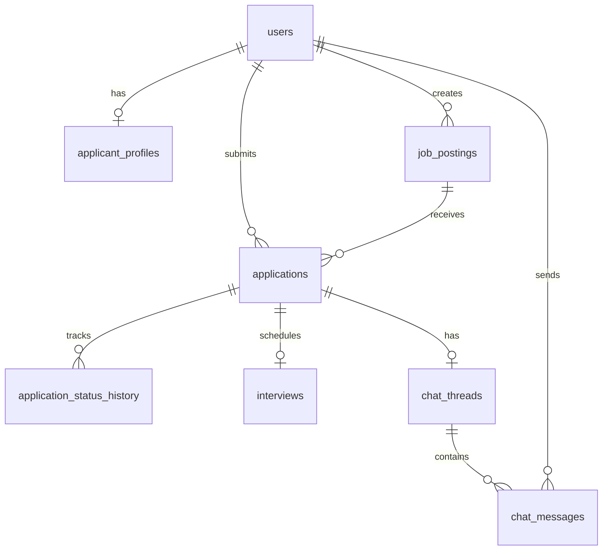

# SCHEMA.md — Database Schema

**Project:** e-recruitment
**Version:** 1.0
**Database:** PostgreSQL

## 1. Prinsip Desain Schema

- **Single-tenant**: tidak ada kolom `tenant_id`/`company_id` di manapun. Satu database = satu perusahaan.
- Primary key menggunakan **UUID**, bukan auto-increment integer — memudahkan migrasi data antar environment (Railway → Docker Compose self-host) tanpa konflik ID.
- Semua tabel punya `created_at`/`updated_at` (timestamp), mengikuti konvensi Laravel.
- Soft delete (`deleted_at`) dipertimbangkan untuk `job_postings` dan `applications` — data rekrutmen punya nilai historis/audit, tidak boleh hilang permanen secara tidak sengaja. Keputusan final per tabel dicatat saat migrasi dibuat di Phase 1/2.

## 2. Tabel

### `users`
Tabel dasar untuk autentikasi, dengan kolom `role` sebagai discriminator (lihat `docs/DECISIONS.md` untuk alasan memilih discriminator column dibanding multi-table inheritance).

| Kolom | Tipe | Keterangan |
|---|---|---|
| `id` | UUID | Primary key |
| `name` | VARCHAR(255) | |
| `email` | VARCHAR(255) | UNIQUE, NOT NULL |
| `password` | VARCHAR(255) | Hashed (bcrypt/argon2) |
| `role` | ENUM('applicant', 'hr_admin') | Discriminator |
| `failed_login_attempts` | INTEGER | Default 0 — untuk FR-001a lockout |
| `locked_until` | TIMESTAMP | Nullable — untuk FR-001a lockout |
| `created_at` | TIMESTAMP | |
| `updated_at` | TIMESTAMP | |

**Index:** `email` (unique), `role`

### `applicant_profiles`
Atribut tambahan khusus Pelamar — dipisah dari `users` untuk menjaga `users` ramping (HR tidak butuh kolom ini).

| Kolom | Tipe | Keterangan |
|---|---|---|
| `id` | UUID | Primary key |
| `user_id` | UUID | FK → `users.id`, UNIQUE |
| `phone` | VARCHAR(20) | |
| `address` | TEXT | |

### `job_postings`

| Kolom | Tipe | Keterangan |
|---|---|---|
| `id` | UUID | Primary key |
| `title` | VARCHAR(255) | NOT NULL |
| `description` | TEXT | |
| `qualifications` | TEXT | |
| `location` | VARCHAR(255) | |
| `deadline` | DATE | |
| `status` | ENUM('draft', 'active', 'closed') | Default 'draft' |
| `created_by` | UUID | FK → `users.id` (harus role hr_admin) |
| `created_at` | TIMESTAMP | |
| `updated_at` | TIMESTAMP | |
| `deleted_at` | TIMESTAMP | Nullable — soft delete |

**Index:** `status` (untuk query listing publik yang filter status='active'), `deadline` (untuk scheduled job auto-close)

### `applications`

| Kolom | Tipe | Keterangan |
|---|---|---|
| `id` | UUID | Primary key |
| `job_posting_id` | UUID | FK → `job_postings.id` |
| `applicant_id` | UUID | FK → `users.id` (harus role applicant) |
| `cv_path` | VARCHAR(500) | Path/key di object storage S3-compatible |
| `cv_original_filename` | VARCHAR(255) | Nama file asli (untuk ditampilkan ke HR) |
| `additional_data` | JSONB | Data form tambahan fleksibel |
| `status` | ENUM('pending', 'shortlisted', 'rejected') | Default 'pending' |
| `applied_at` | TIMESTAMP | |
| `updated_at` | TIMESTAMP | |
| `deleted_at` | TIMESTAMP | Nullable — soft delete |

**Index:** `job_posting_id`, `applicant_id`, `status` (untuk query reporting funnel), composite `(job_posting_id, status)` untuk dashboard HR per-lowongan

### `application_status_history`
Mendukung reporting (FR-018) — funnel seleksi dan time-to-hire dihitung dari tabel ini, bukan hanya `applications.status` (yang hanya menyimpan status terkini).

| Kolom | Tipe | Keterangan |
|---|---|---|
| `id` | UUID | Primary key |
| `application_id` | UUID | FK → `applications.id` |
| `previous_status` | ENUM('pending', 'shortlisted', 'rejected') | Nullable (null untuk entry pertama) |
| `new_status` | ENUM('pending', 'shortlisted', 'rejected') | |
| `changed_by` | UUID | FK → `users.id` (harus role hr_admin) |
| `changed_at` | TIMESTAMP | |

**Index:** `application_id`, `changed_at` (untuk query time-series reporting)

### `interviews`

| Kolom | Tipe | Keterangan |
|---|---|---|
| `id` | UUID | Primary key |
| `application_id` | UUID | FK → `applications.id`, UNIQUE (satu lamaran maksimal satu interview aktif — lihat catatan di bawah) |
| `scheduled_at` | TIMESTAMP | |
| `meeting_link` | VARCHAR(500) | URL meeting — diisi manual oleh HR (Google Meet, Zoom, dll) |
| `status` | ENUM('scheduled', 'completed', 'cancelled') | Default 'scheduled' |
| `created_at` | TIMESTAMP | |
| `updated_at` | TIMESTAMP | |

**Catatan:** Constraint UNIQUE pada `application_id` mengasumsikan satu lamaran hanya punya satu interview aktif pada satu waktu. Jika kebutuhan berkembang ke multi-stage interview (mis. interview HR lalu interview user/teknis), constraint ini perlu direvisi — catat sebagai ADR baru jika terjadi.

**Index:** `application_id`, `scheduled_at`

### `chat_threads`

| Kolom | Tipe | Keterangan |
|---|---|---|
| `id` | UUID | Primary key |
| `application_id` | UUID | FK → `applications.id`, UNIQUE (one-to-one) |
| `created_at` | TIMESTAMP | |

### `chat_messages`

| Kolom | Tipe | Keterangan |
|---|---|---|
| `id` | UUID | Primary key |
| `chat_thread_id` | UUID | FK → `chat_threads.id` |
| `sender_id` | UUID | FK → `users.id` |
| `content` | TEXT | |
| `sent_at` | TIMESTAMP | |

**Index:** `chat_thread_id`, `sent_at` (untuk pagination riwayat chat berurutan waktu)

## 3. Relasi (ERD)

## 4. Strategi Indexing untuk Reporting (NFR-007)

Query reporting (jumlah pelamar per lowongan, funnel seleksi, time-to-hire) bisa menjadi mahal seiring volume data bertambah. Strategi yang dipertimbangkan:
- Index composite `(job_posting_id, status)` di `applications` untuk query funnel per-lowongan
- Index `changed_at` di `application_status_history` untuk query time-to-hire (selisih waktu antar perubahan status)
- Jika volume data sangat besar di kemudian hari, pertimbangkan materialized view atau caching layer (Redis) untuk dashboard reporting — bukan keputusan Phase 5 awal, tapi dicatat di sini sebagai pertimbangan masa depan.

## 5. Catatan Migrasi

Setiap perubahan schema setelah Phase 0 harus melalui Laravel migration file (`database/migrations/`), tidak pernah mengubah struktur tabel secara manual di database production. Setiap migration baru yang mengubah struktur signifikan (menambah tabel, mengubah constraint) wajib disertai entry baru di [`docs/DECISIONS.md`](DECISIONS.md) menjelaskan alasannya.
