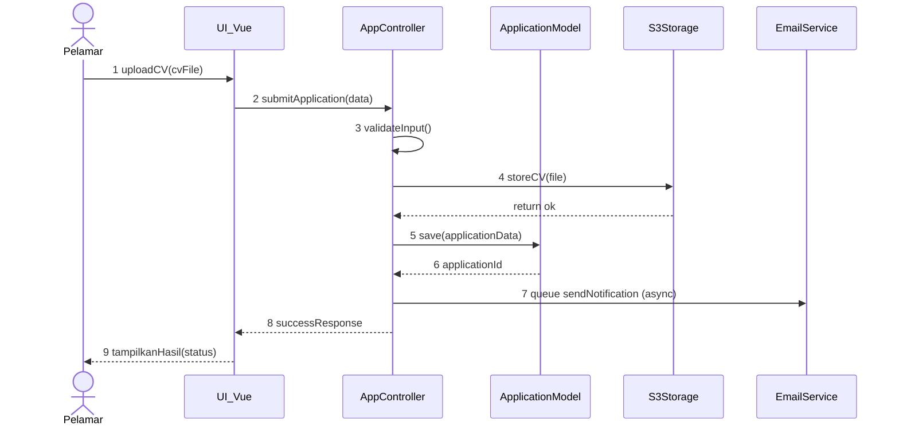
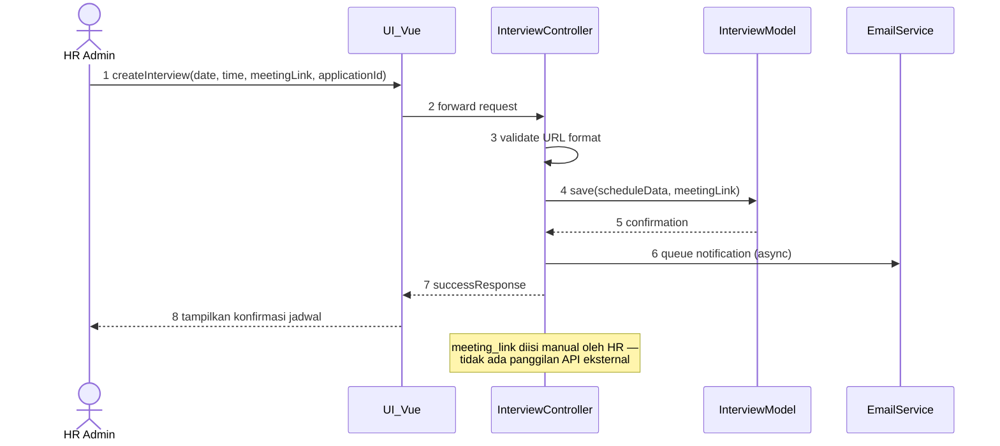
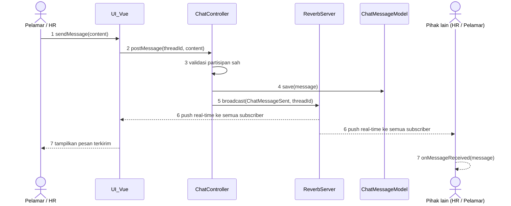

# SEQUENCE-DIAGRAM.md — Critical Interaction Flows

**Project:** e-recruitment
**Version:** 1.0

## 1. Tujuan

Dokumen ini memvisualisasikan garis waktu (timeline) dari proses bisnis kritis dalam bentuk sequence diagram. Tiga alur dipilih karena masing-masing mewakili pola integrasi berbeda yang harus dipahami AI agent sebelum implementasi: REST request-response sinkron (Alur 1), pemanggilan API eksternal (Alur 2), dan komunikasi real-time via WebSocket (Alur 3).

## 2. Alur 1: Pelamar Melamar Pekerjaan (UC-03)

### Partisipan
- **Pelamar** (aktor)
- **:UI_Vue** (View — Vue.js, frontend)
- **:AppController** (Controller — Laravel)
- **:ApplicationModel** (Model — PostgreSQL)
- **:S3Storage** (object storage untuk CV)
- **:EmailService** (Resend — async via queue)

### Kronologi Proses
1. Pelamar mengunggah CV melalui antarmuka Vue.js (`uploadCV(cvFile)`)
2. View meneruskan data ke AppController (`submitApplication(data)`)
3. Controller memvalidasi input secara internal (`validateInput()` — format PDF, ukuran ≤2MB, kelengkapan form)
4. Controller menyimpan file CV ke S3Storage (`storeCV(file)`) — terpisah dari penyimpanan data lamaran, supaya kegagalan storage tidak mengotori record database
5. Controller menyimpan data lamaran ke ApplicationModel (`save(applicationData)`)
6. Model mengembalikan `applicationId`
7. Controller memicu job notifikasi (queued, async) ke EmailService (`sendNotification(email, appId)`) — tidak memblokir response ke pelamar
8. Controller mengembalikan `successResponse` ke View
9. View menampilkan hasil ke Pelamar (`tampilkanHasil(status)`)

### Catatan Implementasi
- Langkah 7 bersifat **asynchronous** (lewat queue Redis) — pelamar tidak menunggu email benar-benar terkirim sebelum melihat konfirmasi sukses. Ini penting untuk memenuhi NFR-001 (submit lamaran selesai ≤5 detik) — pengiriman email yang lambat/gagal tidak boleh memperlambat response utama.
- Validasi MIME type aktual (bukan hanya ekstensi nama file) terjadi di langkah 3 — lihat `docs/SECURITY.md` untuk alasan ini wajib di sisi server.

## 3. Alur 2: HR Menjadwalkan Interview (UC-07)

### Partisipan
- **HR Admin** (aktor)
- **:UI_Vue** (View)
- **:InterviewController** (Controller — Laravel)
- **:InterviewModel** (Model — PostgreSQL)
- **:EmailService** (Resend — async via queue)

### Kronologi Proses
1. HR mengisi tanggal, jam, dan link meeting (manual — dari Google Meet, Zoom, atau platform lain)
2. View meneruskan permintaan ke InterviewController
3. Controller memvalidasi format link meeting (harus URL valid)
4. Controller menyimpan jadwal ke InterviewModel
5. Model mengembalikan konfirmasi tersimpan
6. Controller memicu notifikasi (queued) ke EmailService berisi tanggal, jam, dan link
7. Controller mengembalikan `successResponse` ke View
8. View menampilkan konfirmasi jadwal ke HR

### Catatan Implementasi
- Tidak ada panggilan API eksternal — link meeting diisi manual oleh HR (ADR-024).
- Link meeting divalidasi format URL saja, tidak diverifikasi aktif/tidak.
- Notifikasi tetap asynchronous (queued) seperti sebelumnya.

## 4. Alur 3: Chat Real-time per Lamaran (UC-09)

### Partisipan
- **Pelamar** dan **HR Admin** (kedua aktor, simetris)
- **:UI_Vue** (kedua sisi)
- **:ChatController** (Laravel)
- **:ReverbServer** (Laravel Reverb — WebSocket broadcasting)
- **:ChatMessageModel** (PostgreSQL)

### Kronologi Proses
1. Pengguna (Pelamar atau HR) mengetik pesan dan menekan "Kirim" (`sendMessage(content)`)
2. View mengirim pesan ke ChatController via HTTP POST (`postMessage(threadId, content)`)
3. Controller memvalidasi pengguna adalah partisipan sah dari `ChatThread` tersebut (otorisasi — lihat `docs/SECURITY.md`)
4. Controller menyimpan pesan ke ChatMessageModel (`save(message)`)
5. Controller memicu broadcast event ke ReverbServer (`broadcast(ChatMessageSent, threadId)`)
6. ReverbServer mendorong (push) pesan secara real-time ke semua klien yang subscribe ke channel thread tersebut (kedua partisipan: Pelamar dan HR)
7. View di kedua sisi menerima event dan menampilkan pesan baru tanpa perlu refresh (`onMessageReceived(message)`)

### Catatan Implementasi
- Langkah 3 (otorisasi partisipan) penting karena setiap `ChatThread` terikat ke satu `Application` spesifik — pengguna lain (pelamar lain, atau HR yang tidak menangani lamaran tersebut) tidak boleh bisa subscribe ke channel ini. Lihat `docs/SECURITY.md` untuk model otorisasi channel privat Laravel Reverb.
- Tidak ada langkah "tandai sudah dibaca" (read-receipt) atau "sedang mengetik" (typing indicator) — sesuai keputusan scope di `docs/DECISIONS.md` dan `docs/FR.md` FR-017.

## 5. Ringkasan Pola Integrasi

| Alur | Pola | Alasan |
|---|---|---|
| Melamar Pekerjaan | REST sinkron (submit) + job async (notifikasi) | Submit harus terasa cepat ke pelamar; email tidak boleh jadi bottleneck |
| Jadwalkan Interview | REST sinkron (validasi + simpan) + job async (notifikasi) | HR input manual; tidak ada API eksternal yang dipanggil (ADR-024) |
| Chat Real-time | WebSocket (Laravel Reverb) | Kebutuhan delivery real-time, tidak cocok untuk polling/REST biasa |

AI agent yang mengimplementasikan Phase 2 (Melamar), Phase 3 (Interview), dan Phase 4 (Chat) wajib merujuk pola di atas sebagai arsitektur yang sudah diputuskan — bukan area yang terbuka untuk didesain ulang tanpa pencatatan ADR baru di `docs/DECISIONS.md`.

**Catatan khusus Phase 3:** Alur 2 tidak lagi melibatkan panggilan API eksternal — link meeting diisi manual oleh HR (ADR-024 menggantikan ADR-003).
