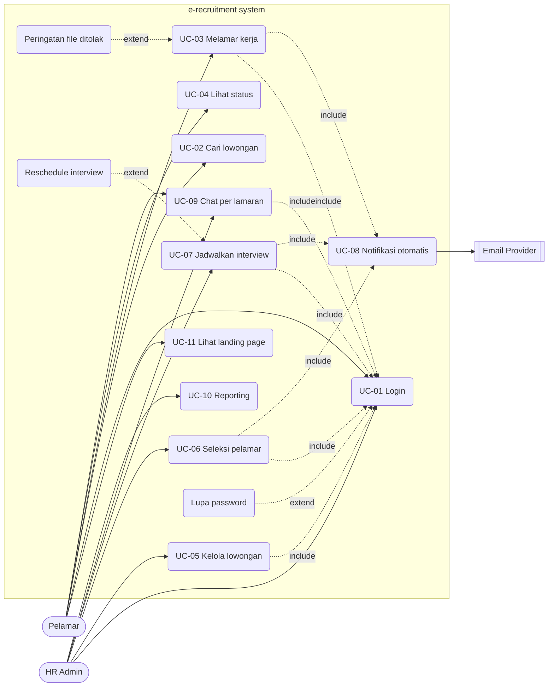

# USECASE.md — Use Case Diagram & Narrative

**Project:** e-recruitment
**Version:** 1.0

## 1. Aktor

### 1.1 Aktor Utama (Primary Actors)

**Pelamar (Applicant)**
- Individu dari luar perusahaan yang mencari informasi lowongan pekerjaan dan ingin melamar
- Pengguna eksternal (publik) — bisa melihat lowongan tanpa login, tapi wajib login untuk melamar
- Tujuan: menemukan pekerjaan yang sesuai, memastikan lamaran diterima, dan mendapat informasi proses seleksi secara jelas

**HR Admin**
- Staf internal perusahaan yang menjalankan proses rekrutmen
- Pengguna internal dengan akses ke dashboard/back-office
- Satu jenis peran tunggal (lihat `docs/DECISIONS.md` untuk alasan tidak ada sub-role)
- Tujuan: mempublikasikan lowongan secara efisien, menyaring kandidat terbaik, menjadwalkan interview, dan memantau performa pipeline rekrutmen

### 1.2 Aktor Pendukung (Secondary Actors)

**Email Provider (Resend/Mailpit)**
- Sistem eksternal yang digunakan untuk mengirim notifikasi email
- Peran: pasif/reaktif — dipicu oleh sistem saat ada event (lamaran terkirim, status berubah, interview dijadwalkan)

**Meeting Link (Eksternal)**
- Link meeting yang diisi **manual** oleh HR saat menjadwalkan interview (dari Google Meet, Zoom, atau platform lain) — bukan hasil integrasi API otomatis (lihat `docs/DECISIONS.md` ADR-024)
- Peran: pasif — hanya data yang disimpan dan dikirim ke pelamar via email; sistem tidak pernah memanggil API eksternal untuk membuatnya

## 1a. Diagram Use Case

## 2. Identifikasi dan Detail Use Case

### Kelompok Aktor: Pelamar

**UC-11: Melihat Landing Page**
- Aktor: Pelamar, pengunjung publik
- Deskripsi: Pengunjung mengakses root URL (`/`) dan melihat landing page perusahaan — hero, tentang perusahaan, benefit, statistik live, CTA ke listing lowongan. Tidak memerlukan login. Mencakup FR-019, FR-020.

**UC-01: Mengelola Akun & Autentikasi**
- Aktor: Pelamar, HR Admin
- Deskripsi: Registrasi akun (khusus Pelamar) dan login ke sistem. Mencakup FR-001, FR-001a, FR-002.

**UC-02: Mencari dan Melihat Lowongan**
- Aktor: Pelamar
- Deskripsi: Melihat daftar lowongan aktif, mencari dengan kata kunci, melihat detail lowongan. Mencakup FR-003, FR-004, FR-005.

**UC-03: Melamar Pekerjaan**
- Aktor: Pelamar
- Deskripsi: Core use case. Mengisi form data diri, mengunggah CV (PDF, maks 2MB), submit lamaran. Mencakup FR-007, FR-008, FR-009.

**UC-04: Melihat Status Lamaran**
- Aktor: Pelamar
- Deskripsi: Melihat riwayat dan status terkini dari semua lamaran yang pernah diajukan. Mencakup FR-010.

**UC-09: Chat dengan HR**
- Aktor: Pelamar, HR Admin
- Deskripsi: Komunikasi real-time terkait satu lamaran spesifik. Mencakup FR-017.

### Kelompok Aktor: HR Admin

**UC-05: Mengelola Data Lowongan**
- Aktor: HR Admin
- Deskripsi: CRUD penuh atas lowongan pekerjaan — tambah, edit, tutup. Mencakup FR-006.

**UC-06: Menyeleksi Berkas Pelamar**
- Aktor: HR Admin
- Deskripsi: Melihat daftar pelamar, melihat/mengunduh CV, mengubah status lamaran. Mencakup FR-011, FR-012, FR-013.

**UC-07: Menjadwalkan Interview**
- Aktor: HR Admin
- Deskripsi: Membuat jadwal interview dengan link meeting yang diisi manual (Google Meet, Zoom, atau platform lain), kirim notifikasi ke pelamar. Mencakup FR-015, FR-016.

**UC-10: Melihat Reporting**
- Aktor: HR Admin
- Deskripsi: Melihat dashboard agregat (jumlah pelamar per lowongan, funnel seleksi, time-to-hire). Mencakup FR-018.

### Kelompok Sistem (Otomatisasi)

**UC-08: Mengirim Notifikasi Otomatis**
- Aktor: Email Provider (Aktor Sekunder)
- Deskripsi: Sistem memicu pengiriman email saat lamaran terkirim, status berubah, atau interview dijadwalkan. Mencakup FR-014.

## 3. Relasi Antar Use Case

### 3.1 Relasi `<<include>>` (Kondisi Wajib)

- **UC-03: Melamar Pekerjaan** `<<include>>` **UC-01: Mengelola Akun & Autentikasi**
  Alasan: Pelamar bisa mencari lowongan tanpa login (UC-02), tapi begitu menekan "Lamar Sekarang", sistem wajib memastikan pelamar sudah login untuk mengetahui identitasnya.

- **UC-05: Mengelola Data Lowongan** `<<include>>` **UC-01: Login**
  Alasan: Fitur HR tidak boleh diakses publik — HR wajib login untuk memverifikasi hak aksesnya.

- **UC-06: Menyeleksi Berkas Pelamar** `<<include>>` **UC-01: Login**
  Alasan: Data CV pelamar bersifat rahasia (lihat `docs/SECURITY.md` untuk kontrol akses data sensitif), wajib login.

- **UC-07: Menjadwalkan Interview** `<<include>>` **UC-01: Login**
  Alasan: Sama seperti di atas — fitur HR wajib terautentikasi.

- **UC-09: Chat dengan HR** `<<include>>` **UC-01: Login**
  Alasan: Chat terikat ke identitas pengguna dan lamaran spesifik — wajib login untuk kedua pihak.

- **UC-03: Melamar Pekerjaan** `<<include>>` **UC-08: Mengirim Notifikasi Otomatis**
  Alasan: Setiap lamaran yang berhasil dikirim otomatis memicu email konfirmasi.

- **UC-06: Menyeleksi Berkas Pelamar** `<<include>>` **UC-08: Mengirim Notifikasi Otomatis**
  Alasan: Setiap perubahan status oleh HR otomatis memicu email notifikasi ke pelamar.

- **UC-07: Menjadwalkan Interview** `<<include>>` **UC-08: Mengirim Notifikasi Otomatis**
  Alasan: Jadwal interview yang berhasil dibuat otomatis memicu email berisi link meeting.

### 3.2 Relasi `<<extend>>` (Kondisi Opsional/Tambahan)

- **Menampilkan Peringatan File Ditolak** `<<extend>>` **UC-03: Melamar Pekerjaan**
  Alasan: CV wajib PDF dan maksimal 2MB (lihat NFR-008). Peringatan ini hanya muncul jika pelamar mengunggah file yang salah format/ukuran.

- **Memulihkan Kata Sandi** `<<extend>>` **UC-01: Mengelola Akun & Autentikasi**
  Alasan: Hanya dijalankan jika pengguna lupa password — pengguna normal tidak melewati alur ini.

- **Reschedule/Batalkan Interview** `<<extend>>` **UC-07: Menjadwalkan Interview**
  Alasan: Hanya terjadi jika ada perubahan jadwal setelah interview awal dibuat.

## 4. Use Case Narrative (Skenario Detail)

### UC-01 — Mengelola Akun & Autentikasi (Login)

- **Tujuan:** Memverifikasi identitas pengguna agar dapat mengakses fitur sesuai hak akses (Pelamar atau HR).
- **Kondisi Awal:** Pengguna berada di halaman login.

**Alur Utama:**
1. Pengguna memasukkan Email dan Password.
2. Pengguna menekan tombol "Masuk".
3. Sistem memvalidasi format email dan mencocokkan kredensial dengan database.
4. Sistem memeriksa peran pengguna.
5. Sistem mengarahkan pengguna ke halaman sesuai peran (Beranda untuk Pelamar, Dashboard untuk HR).

**Alur Alternatif:**
- **A1 — Kredensial Salah:** Sistem menampilkan pesan error generik "Email atau Kata Sandi salah", membersihkan kolom password, dan menghitung percobaan gagal. Pada percobaan ke-3, akun terkunci sementara (lihat FR-001a).
- **A2 — Lupa Kata Sandi (`<<extend>>`):** Pengguna memilih "Lupa Password?" → sistem menampilkan form email pemulihan → pengguna submit → sistem mengirim link reset via email → konfirmasi pengiriman ditampilkan.

**Kondisi Akhir:** Pengguna berhasil masuk dengan sesi aktif dan akses sesuai perannya.

### UC-03 — Melamar Pekerjaan

- **Tujuan:** Pelamar berhasil mengirimkan lamaran lengkap untuk satu lowongan spesifik.
- **Kondisi Awal:** Pelamar berada di halaman detail lowongan, sudah login (via include UC-01).

**Alur Utama:**
1. Pelamar menekan "Lamar Sekarang".
2. Sistem menampilkan form lamaran (data diri + upload CV).
3. Pelamar mengisi data diri dan mengunggah CV (PDF).
4. Sistem memvalidasi format dan ukuran file CV.
5. Pelamar menekan "Kirim Lamaran".
6. Sistem menyimpan record lamaran dengan status awal "Menunggu".
7. Sistem memicu notifikasi konfirmasi (include UC-08).

**Alur Alternatif:**
- **A1 — File Ditolak (`<<extend>>`):** Pada langkah 4, jika file bukan PDF atau ukuran >2MB, sistem menampilkan peringatan spesifik dan meminta pelamar mengunggah ulang.
- **A2 — Data Belum Lengkap:** Pada langkah 5, jika ada field wajib yang kosong, sistem menampilkan field mana yang kurang, lamaran tidak tersubmit.

**Kondisi Akhir:** Lamaran tersimpan dengan status "Menunggu", pelamar menerima email konfirmasi.

### UC-06 — Menyeleksi Berkas Pelamar

- **Tujuan:** HR meninjau CV pelamar dan mengubah status lamaran.
- **Kondisi Awal:** HR sudah login, berada di halaman detail lowongan.

**Alur Utama:**
1. HR memilih "Daftar Pelamar" pada lowongan aktif.
2. Sistem menampilkan tabel pelamar (nama, tanggal melamar, status).
3. HR memilih satu pelamar untuk melihat detail.
4. Sistem menampilkan profil pelamar dan tombol "Unduh/Lihat CV".
5. HR meninjau CV, memilih "Ubah Status Lamaran".
6. Sistem menampilkan dropdown status (Menunggu / Lolos Seleksi Berkas / Ditolak).
7. HR memilih status baru, menekan "Simpan".
8. Sistem memperbarui status di database dan memicu notifikasi (include UC-08).

**Alur Alternatif:**
- **A1 — CV Gagal Dimuat:** Pada langkah 4, jika file CV korup/gagal dibaca, sistem menampilkan peringatan "Dokumen tidak dapat dimuat" dan menyarankan HR menghubungi pelamar.

**Kondisi Akhir:** Status pelamar diperbarui, pelamar menerima notifikasi hasil seleksi.

### UC-07 — Menjadwalkan Interview

- **Tujuan:** HR menjadwalkan interview untuk pelamar yang lolos seleksi berkas, dengan link meeting yang diisi manual.
- **Kondisi Awal:** HR sudah login, pelamar berstatus "Lolos Seleksi Berkas".

**Alur Utama:**
1. HR memilih pelamar dan menekan "Jadwalkan Interview".
2. HR mengisi tanggal, jam, dan link meeting secara manual (dari Google Meet, Zoom, atau platform lain).
3. HR menekan "Buat Jadwal".
4. Sistem memvalidasi format link meeting (harus URL valid) — tidak ada panggilan API eksternal (ADR-024).
5. Sistem menyimpan jadwal dan link, terhubung ke record lamaran.
6. Sistem memicu notifikasi berisi tanggal, jam, dan link (include UC-08).

**Alur Alternatif:**
- **A1 — Link Tidak Valid:** Pada langkah 4, jika link meeting bukan URL valid, sistem menampilkan error ke HR, jadwal tidak tersimpan, dan HR diminta memperbaiki link.
- **A2 — Reschedule (`<<extend>>`):** HR dapat mengubah jadwal/link yang sudah ada; sistem memperbarui record dan kirim ulang notifikasi.

**Kondisi Akhir:** Jadwal interview tersimpan, pelamar menerima link meeting via email. Interview itu sendiri berlangsung di luar sistem (di platform meeting eksternal seperti Google Meet/Zoom).

## 5. Validasi Model Use Case (Aturan 3C)

**Correctness** — Apakah use case memecahkan masalah bisnis dan mematuhi batasan di SRS?
Use case mematuhi batasan single-tenant (tidak ada use case multi-company), validasi format file (UC-03 A1), dan kewajiban login untuk fitur sensitif (`<<include>>` UC-01 di semua use case HR).

**Completeness** — Traceability Matrix:

| FR | Use Case |
|---|---|
| FR-019, FR-020 | UC-11 |
| FR-001, FR-001a | UC-01 |
| FR-002 | UC-01 (extend) |
| FR-003, FR-004, FR-005 | UC-02 |
| FR-007, FR-008, FR-009 | UC-03 |
| FR-010 | UC-04 |
| FR-006 | UC-05 |
| FR-011, FR-012, FR-013 | UC-06 |
| FR-014 | UC-08 |
| FR-015, FR-016 | UC-07 |
| FR-017 | UC-09 |
| FR-018 | UC-10 |

**Clarity** — Narrative menggunakan kalimat aktif berorientasi tujuan pengguna ("HR menekan tombol...", "Sistem menampilkan...") tanpa bahasa teknis tingkat rendah.
